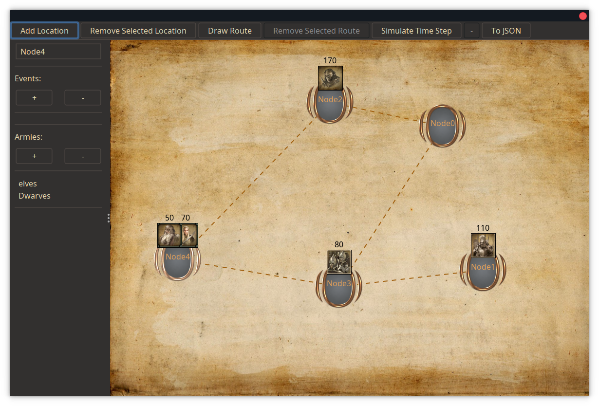

cd l# RTS

In the epic conclusion of the OOP cinematic universe, you will be creating a Lord of the Rings-themed battle simulator. The idea is to provide the user with an editor where they can create a map consisting of locations and routes between those locations. The user can then add armies and simulate some battles!



> The above image is just an example to give you an idea. You don't need to replicate it perfectly.

The map is resembled by a simple undirected graph. In this graph, the nodes represent important locations, while edges represent routes between those locations. In the world, there are several armies. These armies move from location to location. On any location or route, the armies can encounter events. If enemy armies encounter each other, they will battle it out, until only one team survives. It is your job to create an editor that allows the user to configure these locations, routes, armies and events. Once the user is happy with their configuration, they will be able to simulate the scenario they created.

This final assignment will test several skills such as Swing, MVC, Java IO, and the ability to complete a reasonably complicated project. You will be implementing the GUI using Java Swing. The reason we want you to use Swing is not because it creates the prettiest applications (although it definitely can), but rather because it teaches you the basics and underlying mechanics of how GUIs work. This will provide you with a solid base and make your life easier when you want to use other GUI frameworks in the future. Additionally, there are lots of large applications written using Swing (IntelliJ, for example) and it is still widely used.

The assignment is split into two parts. In the first part, you will be creating the user interface (UI). The second part consists of adding all sorts of fancy logic and features to the simulation. For this assignment, you will also have to write a report **in the form of a Markdown (`.md`) file**.

Your design is - once again - very important for this assignment. You will have to add a lot of features to your program, so the better your design, the easier it is to add these new features. If you blindly start coding in the beginning, you might find that you have to do a lot of rewrites when adding new features. Having a strong foundation makes your own life significantly easier.

Consequently, please read this assignment as a whole before starting, so that you have an idea of what you have to add eventually. This way, you can consider this when designing your program.

___

For this project, there are three deadlines.

#### Intermediate Deadline

- Part 1 should be completed. You don't need to actively hand in anything for this deadline, but it is **mandatory** to attend the intermediate demo. During this demo, your progress will be discussed and you can get some feedback on your code. This is not graded, but if you have not made sufficient progress (i.e. part 1 is not done yet), then there will be negative consequences for your grade.
- During the intermediate demo, your TA will give you some feedback on your code once you have shown them what you have so far. However, this means that the feedback you get can be quite general. If you want more specific feedback on parts of your program, you should create an issue **at least 24 hours before** the intermediate demo, so that your TA can have a look.
- Note that you are highly advised to complete more than just part 1 for the intermediate demo. Any additional functionality that you implement, you might be able to get feedback on. Additionally, it ensures that you do not have a lot of last-minute things to do before the final deadline.
- You should also fill in the midterm evaluation form before the intermediate demo.

#### Soft Final Deadline


Ideally, parts 1 and 2 should be completed, in addition to the report. If you complete your project and create a valid pull request before this deadline, you will automatically receive a 0.5 bonus (on top of the regular bonus points). Note that you can only get this bonus if the grade is already sufficient. You should aim for this deadline, as the hard deadline is during the exam week.

#### Hard Final Deadline

Parts 1 and 2 and the report must have been completed.

Due to having both a soft and a hard deadline, we will **not** be giving any deadline extensions. Think of the hard deadline as a pre-emptive deadline extension of 7 days in case you need it. There is plenty of time to complete this project, so use it well and don't start late.

# Disclaimers

In this assignment, we will be slightly less specific about what you have to implement. We will still provide a list of requirements, but it is up to you to determine how to implement them. This is also done to simulate a bit more accurately what would happen in the real world. Most often, you are not given an extensive list of concrete requirements, but rather some vague descriptions of what the application should do. Lucky for you, we won't be that vague though...

That said, in some cases, it is up to you to decide what the program should display (e.g. if the user did not select anything). Simply think about what you would expect a real-world application to do in these kinds of scenarios.

In addition to the requirements we provide, there are also some constraints (as you will see later on), where you have to implement certain things yourself instead of using existing tools/libraries. The reason for this is to give you an idea of how these things actually work instead of blindly using them (similar to how we want you to use Swing and not some more advanced GUI framework that does a lot of the work for you).

You might also find that not everything asked from you here has been discussed during the lectures, tutorials or in the reader. There is an enormous collection of different classes that Swing provides and it is impossible to cover them all. As such, you will have to use Google for quite a bit of it. Lucky for you, the documentation provided by Oracle (which we also link in certain cases) is quite good. This is also a nice way to train your Google skills; arguably one of the most important skills you can have as a software engineer. That said, you can reduce the amount of Googling you have to do significantly by watching the tutorials. In addition, there is still a bunch of basic info available to you via the lectures and reader, so be sure to [look at this](https://www.youtube.com/watch?v=dQw4w9WgXcQ) before you start (◔‿◔)

> Hint: One very useful (visual) resource for Swing components you can use can be found [here](https://web.mit.edu/6.005/www/sp14/psets/ps4/java-6-tutorial/components.html).

## Working Together on (Larger) Projects

As the amount of required code for the assignments increases, so does the difficulty of properly managing such a project. We will provide you with some tips on how to deal with this. Note that this part is not mandatory; it will simply make things a bit easier to manage.

### Organising Tasks

Before you start, it is a good idea to have a brainstorming session. Write down all the things you want and need to do for this project. Now you should have a good idea of what you want to implement. Try to split these things into different tasks and sort them by priority. You now have a list of things you need to do and the order in which you should do them. Awesome! This is called a backlog. Since you are working together, it is a good idea to assign a person to each task. Keep in mind that it is perfectly valid to assign two people to a task; we want to urge you to work together as much as possible. That said, the simplest form this takes is a table that looks something like this:

| What                                           | Who                           | When (deadline) |
| -----------------------------------------------|-------------------------------|-----------------|
| The view should update when the model updates  | Niels                         | 09/05 at 12:00  |
| Armies should be able to move around the nodes | Erblin                        | 11/05 at 12:00  |
| Take over the RUG (つ◕౪◕)つ━☆ﾟ.*･｡ﾟ             | ~~Niels~~ ~~Erblin~~ ~~Niels~~ Mohammad    | 2024            |

It is not necessary to create the entire backlog in one go. In fact, it's rarely possible to create a fully exhaustive list beforehand. Worry not, however; you can simply keep adding new tasks to it throughout the development process. Whenever a task is done, you can mark it as such or remove it. If you decide to remove it, it is a good idea to save it somewhere so that you have a good idea of what has been done already.

As you can see, backlogs are a nice way to keep track of what still needs to be done. You can add a lot more detail to this backlog, such as estimations of how long tasks will take, but you can also split up the tasks even more. Try not to make your tasks too large, because that will make it difficult to properly distribute tasks and see progress.

>Tip: There are a few different ways you can make such a backlog. An easy one would be Google Sheets, but a more dedicated tool that you can also go for is [Trello](https://trello.com/), which is what we would recommend. These tools can be incredibly helpful, as it makes communication with your partner a lot smoother. After all, it should now be very clear who needs to do what (and when).

As always, clearly and frequently communicate with your partner. Don't just blindly distribute tasks, but actually work together on the project.

> On a slightly unrelated note: don't forget to frequently run `mvn clean compile` to make sure that your code still passes the required checks. For example after each task you complete.

---

# Assignment Description

---

## Part 1

As always, read through all the steps first before you start implementing things.

### 1.1 The Map

The map of our editor/simulator is represented by an undirected, simple, unweighted graph. We will briefly walk through the steps to implement this below. Note that - to prevent any confusion - we will refer to locations as "nodes", routes as "edges" and the map as a "graph" for the remainder of the description.

1. Create a class that represents a node.

	- Every node has a unique (integer) id and a name.
	- Every node has a list of edges.

2. Create a class that represents an edge.

	- Every edge has a unique (integer) id and a name.
	- An edge always connects two nodes.

3.  Create a class that keeps track of all the nodes and edges.

	- Add methods for adding and removing nodes and edges. Remember that every connected edge should be removed when a node is removed.

### 1.2 A Basic Frame

Now that we have the basic model, we can start working on the GUI. ٩ʕ◕౪◕ʔو

4. Start by creating a frame to work in. This will be the main frame of the editor.
5. Give the frame an appropriate title and default size, and make sure it appears in the middle of the screen.
6. Create a mainPanel class that inherits from `JPanel`. This is where the drawing of the graph will take place.
7. Make sure that this mainPanel is visible in the main frame. At the start, you can do something like `setBackground(Color.RED);` in your custom mainPanel class to make sure you can see the mainPanel.
8. Give the frame a basic menu bar with buttons for adding and removing nodes and edges. Do not add actions to these buttons just yet (just pass `null` as the required action).

> If at this point you are very confused about how to do all this, please watch the tutorial(s) (or spend a lot of time Googling).

### 1.3 Painting

Before we start with this part: you have been provided with a single class in the template: `TextureLoader`. This file can be used to load the textures found in the `images` directory into your program. **You do not have to use this**. Simple coloured shapes are fine as well, but textures can make it significantly more fun and it is very straightforward to use. Be sure to read the documentation of this class, as it fully explains how to use it and how it works.

9. Make sure that the mainPanel has access to the information it needs for drawing the graph.
10. Add functionality that draws the nodes. For now, you can draw a node by first drawing e.g. a rectangle and then the name. You can use fancy textures later on, but you are advised to do this only after you have finished the important parts of the project.
11. Add functionality that draws all the edges. Keep in mind that everything that is drawn first ends up behind something that is drawn later.

> At this point you can test this by hard-coding some nodes and edges in your code. Make sure to remove this eventually though!

### 1.4 Selecting Nodes

12. Allow the user to select nodes by implementing a class that extends [MouseAdapter](https://docs.oracle.com/javase/7/docs/api/java/awt/event/MouseAdapter.html). A node should be selected when the user clicks on it.
13. Your mainPanel will not magically update when something happens in your model. To do this, implement the Observer pattern by creating your own listener implementation.

	- It is very important that your `model` has no knowledge of the `view`. Your view should listen to your model. Whenever your `model` updates something that affects the `view`, the `view` should update accordingly. This is accomplished via the Observer pattern.
	- You are not allowed to use the existing `Observer`/`Observable` implementations that Java provides.

14. Selected nodes should be highlighted in some way (e.g. a different colour) so that the user knows whether a node is selected or not.
15. Allow the user to move nodes by dragging around a selected node.

### 1.5 UI Functionality

16. Now that we are able to select nodes, we can add the functionality for the buttons:

    - Allow the user to add a node. You can decide to ask the user immediately for a name, but you can also decide to give it an initial default name such as `node0`, `node1`, etc. as the user adds more nodes. The user will have to be able to rename nodes later, so which one you chose does not matter much at this point.
    - Allow the user to remove a node when a node is selected.
    - Allow the user to add an edge. Before this option is available, the user should first select a node. With a node selected, the user can click the `Add Edge` button and select another node. Once the user has selected another node, an edge will be drawn between the two nodes. You can of course make this fancier, but that is up to you.
    - Allow the user to remove an edge. This means you will need to add functionality to select an edge as well. Make sure that selected edges are highlighted in some way.

17. Ensure that the buttons are disabled when the pre-conditions are not met. For example, the user did not select a node, so the button for removing a node is not enabled. To do this, you can - similar to the `view` - let your button actions listen to the `model` and update accordingly via the `setEnabled` method.

### 1.6 Options Menu

Eventually, we need to be able to add armies, events and actions to nodes/edges. As a result, we need a separate menu to do this.

18. Create a new `JPanel` that will serve as the options menu (not to be confused with a menu bar).
19. Whenever a node is selected, a mainPanel should be shown with the details of said node. For now, simply printing the name is sufficient. We will refer to this mainPanel as the "node menu".

	- You can do this in various ways. You can, for example, create a new frame with this menu. However, this is not the prettiest solution and you would have to ensure to close the frame once a node is deselected.
	- Alternatively, you can use a `JSplitPane` to add another mainPanel to the same frame (similar to the picture at the start of the readme). This makes sure that everything is nicely presented to the user in the same frame. All you have to do when a user deselects a node is to replace the mainPanel (or contents thereof) with something appropriate (e.g. a message "Nothing selected").

20. Similarly, whenever an edge is selected, a mainPanel should appear with the details of said edge. Here, you should print the names of the two nodes that the edge connects. We will refer to this mainPanel as the "edge menu".
21. Allow the user to edit the name of a node/edge. You can use a [JTextField](https://docs.oracle.com/en/java/javase/17/docs/api/java.desktop/javax/swing/JTextField.html) for this.

## Part 1 - Requirements Summary

Below is a list of all the things your program should be able to do. Note that you should still pay attention to the steps described above! This only serves as a very compressed summary.

Your program should be able to:

- Draw a graph
- Select and move nodes. Selected nodes should be highlighted in some way.
- Select edges. Selected edges should be highlighted in some way.
- Add nodes
- Remove nodes
- Add edges
- Remove edges
- Selecting a node should show a mainPanel containing the details of said node. For now, the name of the node should be printed in this mainPanel.
- Selecting an edge should show a mainPanel containing the details of said edge. For now, the names of the two nodes the edge connects should be printed.

Additionally, make sure your program properly follows the MVC pattern.

---

## Part 2

Now that we have a basic UI, it is time to start adding some more fun logic to our simulation. Before you continue, be sure that you have all functionality of Part 1. Additionally, if you received any feedback from your TA, implement that first before moving on.

While you still have to add some UI items in this part, it mostly focuses on adding more complex logic to the application.

### 2.1 Armies

At this point, we need something to simulate. For this, we will use armies.

1. Create a class resembling an army.
2. An army has a number of units.
3. A unit has damage, health and a name.
4. Armies belong to a certain faction. In this project, there will be five factions: `Men`, `Elves`, `Dwarves`, `Mordor` and `Isengard`.
5. Every army belongs to a given team. For this particular simulation, `Men`, `Elves` and `Dwarves` belong to the same team. Similarly, `Mordor` and `Isengard` also belong to the same team.
6. Every faction has several available unit names. An army belonging to a certain faction can only have units with the names of said faction. Some example unit names for each faction:

	- `Men`: `Gondor Soldier`, `Tower Guard`, `Ithilien Ranger`
	- `Elves`: `Lorien Warrior`, `Mirkwood Archer`, `Rivendell Lancer`
	- `Dwarves`: `Guardian`, `Phalanx`, `Axe Thrower`
	- `Mordor`: `Orc Warrior`, `Orc Pikeman`, `Haradrim archer`
	- `Isengard`: `Uruk-hai`, `Uruk Crossbowman`, `Warg Rider`

7. Both nodes and edges should be able to "contain" armies, i.e. armies should be able to be present on both nodes and edges.
8. Add buttons to the node menu that allows the user to add/remove armies to/from the selected node. You do not need to add these buttons for the edges.
9. When the user wants to add an army to a node, the user should receive the option to select a faction (hint: use a `JOptionPane` for this)
10. Newly added armies should have a random number of units (e.g. between 10 and 50, or perhaps an amount depending on which faction). The units in the armies should have random unit names from the given faction. If you want to take this one step further (**you don't need to**), you can create a separate class for each unit. This way, you could add more fancy functionality to individual unit types later. This is a bonus, however.
11. Draw something on top of a node/edge whenever an army is present. You can decide to use the `TextureLoader` for this, but a simple circle or rectangle is also sufficient. If you decide to do this, make sure to give armies of the same faction the same colour.

### 2.2 Simulation

Now that we have some basic movable armies, it is time to create a simple simulation.

12. Create a class responsible for the simulation.
13. We will simulate one step at a time. A single simulation step will eventually consist of multiple phases, but for now, it's just a single phase. Add a method responsible for simulating a single time step.
14. For now, all that happens in a single time-step is that every army will randomly pick one of the outgoing edges of the node it is currently located on and move to this edge.
15. At this point in the simulation step, every army is located at an edge. Later, we will add more stuff on these edges, but for now, the armies immediately move to the other node of the edge.
16. Add a button that allows the user to simulate a single time step.
17. Add a few armies and try to simulate a number of time steps. Verify that the armies move as expected.

### 2.3 Battles

Of course, we need some more interesting things in our simulation, so it is time to allow our armies to battle.

18. Whenever armies of different teams reside on the same node or edge, a battle happens.
19. Add some functionality that resolves a battle.

	- How complicated you want to do this is up to you. At the very least, the outcome of which army wins should depend on the number of units in the army and how strong the units in the army are (their health and damage).
	- You should try to design this in such a way that it would be easy to add more complex or different battle scenarios.

20. Resolving battles should be done three times throughout a given simulation step.

	1. At the very beginning (when armies of different teams start at the same node)
	2. After armies have moved to an edge.
	3. After armies have moved from their edge to the node on the other side.
	- Note that there are not always battles to resolve.

21. Armies that have been defeated should be removed from the graph entirely.
22. Only the armies of a single team can remain alive after a battle. I.e. only a single team can be the victor of a battle.
23. Once again, verify that the armies still move as expected and that any battles are resolved as expected whenever armies of different teams are on the same node/edge.
24. Verify that this works correctly when multiple armies of the two teams are present on a node.

### 2.4 Events

Of course, just having some battling armies is not the most interesting thing. As such, we want armies to encounter random events.

25. Add something to model a general event. An event affects the army that encounters said event. Some examples of events could be:

	- Reinforcements event: adds units to the army.
	- Natural disaster event: removes a number of units from the army.
	- Hidden weaponry event: improves the weapons of an army, giving their units increased damage.

	However, you are of course encouraged to come up with your own events as well. **You should Implement at least three different kinds of events.**

26. Nodes and edges should both be able to have events.
27. Allows the user to add/remove events to/from nodes & edges. Once again, you can use a `JOptionPane` to allow the user to select one of the existing events.
28. Whenever an army arrives at a node/edge for the first time during a simulation step, it should encounter one of the events present at the said location at random:

	- There should be a chance not to encounter any event at all (e.g. 50%).
	- If the army encounters an event, it should be a random available event from the node/edge the army is on.

29. Make sure that the user is somehow aware of what event has happened (and to which army). You can do this by drawing some fancy stuff or using a simple popup message.

### 2.5 Full simulation step

At this point, a single simulation step should consist of the following phases:

1. At the beginning of a simulation step, all armies are on a node.
2. (possibly) resolve any battles on these nodes.
3. Move the armies to a random edge.
4. (possibly) resolve any battles on these edges.
5. Let the armies encounter a random event on the edge.
6. Move the armies to the node on the other side of the edge.
7. (possibly) resolve any battles on these nodes.
8. Let the armies encounter a random event on the node.

### 2.5 Saving to JSON

Finally, we want to be able to export the entire state of the simulation to a file. For this, we will be using the JSON format. Below we will go over the format of how every part should be saved. This is the minimal amount of saving you need to do. It is of course nice to also save additional properties you added.

Note that you are not allowed to use any libraries for this! It is up to you to come up with a good design and implementation of how to do this.

To understand the format of JSON, we only need three syntactic ingredients (for this assignment at least):

1. JSON can be used to describe objects. These objects are wrapped in curly braces: `{}`
2. The backbone of a JSON object consists of key-value pairs: `key: value`. Keys are always strings, while values can take a lot of formats.
3. Lists of objects (or strings) are wrapped in square brackets: `[]`. Items within a list are separated with a comma.

This might sound vague, so here is an example JSON file for this assignment:

```json
{
  "Nodes": [
    {
      "Id": 0,
      "Name": "Node0",
      "Armies": [
        {
          "Faction": "Mordor",
          "Team": 1,
          "Units":[
            {
              "Name": "Orc Warrior",
              "Strength": 10,
              "Health": 100
            },
            {
              "Name": "Orc Pikeman",
              "Strength": 5,
              "Health": 120
            }
          ]
        }
      ],
      "Events": [
        "Battle Event"
      ]
    },
    {
      "Id": 1,
      "Name": "Node1",
      "Armies": [],
      "Events": []
    }
  ],
  "Edges": [
    {
      "Id": 1,
      "Name": "Edge0",
      "Node1": "Node0",
      "Node1": "Node1",
      "Events": [],
      "Army": []
    }
  ]
}
```

The general format for this assignment is as follows:

- `<Graph>`:

	```json
	{
	  "Nodes": [
	    <Node>, <Node>, ..
	  ],
	  "Edges": [
	    <Edge>, <Edge>, ..
	  ]
	}
	```

- `<Node>`:

	```json
	{
	  "Id": <Number>,
	  "Name": <String>,
	  "Armies": [
	    <Army>, <Army>, ..
	  ],
	  "Events": [
	    // Name of each event
	    <String>, <String>, ..
	  ]
	}
	```

- `<Edge>`:

	```json
	{
	  "Id": <Number>,
	  "Name": <String>,
	  "Node1": <Number>, // Id of node 1
	  "Node2": <Number>, // Id of node 2
	  "Armies": [
	    <Army>, <Army>, ..
	  ],
	  "Events": [
	    // Name of each event
	    <String>, <String>, ..
	  ]
	}
	```
- `<Army>`:

	```json
	{
	  "Name": <String>,
	  "Faction": <Name>,
	  "Team": <Number>,
	  "Units":[
	    <Unit>, <Unit>, ..
	  ]
	}
	```
- `<Unit>`:

	```json
	{
	  "Name": <String>,
	  "Strength": <Number>,
	  "Health": <Number>
	}
	```

While it might seem complicated, once you get the hang of it, it is a very intuitive format. With all that information, it is time to implement this.

30. Add a button to the menu bar that allows the user to save the simulation.
31. Pressing this button should allow the user to pick a location/file to save to. You can use a `JFileChooser` for this.
32. Once a file has been chosen, save the state of the simulation in the format described above.
33. Make sure the file is saved with the `.json` extension.
34. Verify that the output is correct. Also, verify that you do not get any errors if the user does something unexpected. Lastly, if you have any additional important information in any classes that you save, be sure to save this as well.

> **Hint**: The indentation can be quite tricky to get right. Focus first on writing the correct values to a file. Once that works properly, focus on getting the correct indentation.

Note that the saving as described in the format above does not save your entire state perfectly. Since you don't have to implement loading, this doesn't matter. You are, however, encouraged to think about which additional properties you would have to save to properly be able to load the simulation again.

## Report

For this assignment, you will have to write a short report in which you will describe your program and the corresponding design decisions. This report should be written in markdown in the `report.md` file. Note that you don't need to know what markdown is or how it works exactly; just fill it in as a normal text file. If you want to make it look a bit nicer, you can look [here](https://github.com/adam-p/markdown-here/wiki/Markdown-Cheatsheet).

We do not expect a massive, full-on architecture document; just be sure to discuss everything mentioned in the template, which will (likely) result in 1000-2000 words.

---

## Extra

Now that the basic program is done, you can finally add some extras! As with the previous assignments, these are not mandatory but can give you some bonus points. Examples could be:

- Textures
- Sounds
- More complex combat
- Units with varying abilities/properties
- More sophisticated army generation (involving user input)
- More sophisticated pathing for the armies (instead of just picking a random edge)
- Allow the user to play one of the armies
- Loading from JSON
- Actions that the armies can (randomly) execute
- Undo & Redo for adding/removing nodes & edges

---

## Handing in + Grading

When you are finished:

- First run `mvn clean compile`. Only once that compiles successfully, continue.
- Create a pull request from the `rts` branch into the `main` branch❗
- **Make sure that all the checks pass**❗❗
- Fill in the peer evaluation form (thruthfully).

The point distribution for your grade will look as follows:

| Category      | Max points    |
| ------------- |:-------------:|
| Functionality | 4             |
| Design        | 3             |
| Code quality + documentation | 1   |
| Answers to the questions & Report | 2   |
| Bonus         | 1             |

Note that if you have less than 2 points for functionality, the design part is capped at 1.5 points.

For design, we will be paying attention to things such as good use of inheritance, encapsulation, polymorphism etc.
